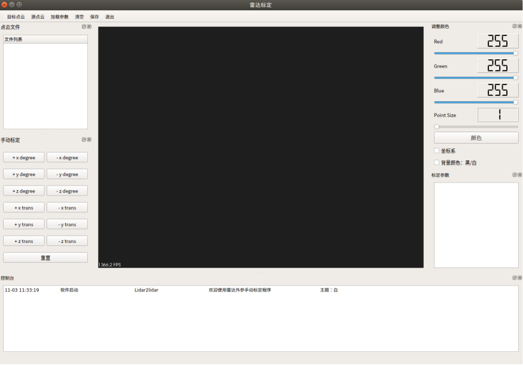
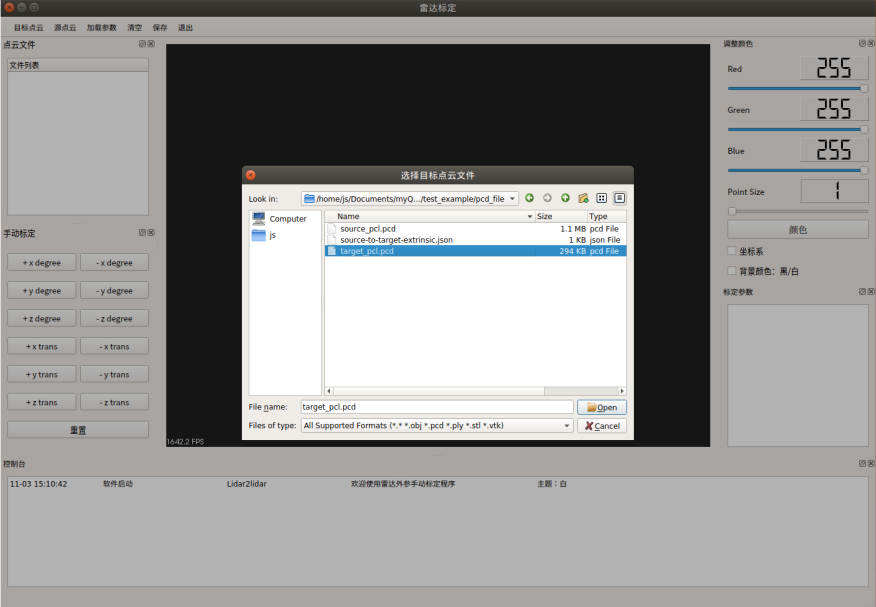
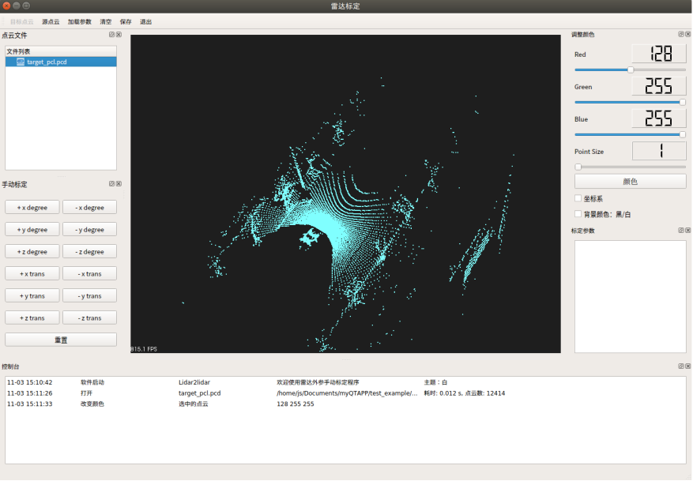
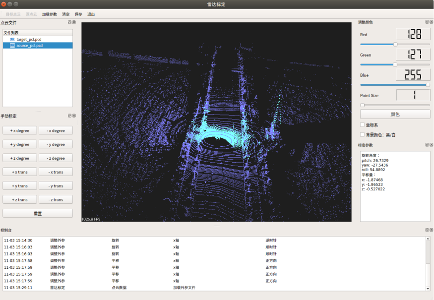

# Calib_lidar2lidar

激光雷达外参标定软件

功能：手动标定激光雷达点云外参

环境：

- ubuntu 18/20

- PCL 不低于 1.7.1

运行方式：

```bash
git clone https://github.com/NovemberChopin/Calib_lidar2lidar.git
cd Calib_lidar2lidar
make build && cd build
cmake ..
make -j4
./src/Lidar2Lidar
```


软件截图：



最上方为工具栏：

- 目标点云：加载目标点云文件(后缀为pcd)
- 源点云：加载源点云文件（注意：本工具标定的是**源点云**到**目标点云**之间的外参）
- 加载参数：点击加载源点云与目标点云之间的外参
- 清空：清空界面
- 保存：保存当前界面的所有点云数据
- 退出：退出软件

左侧上半部分Dock栏为打开的点云文件列表，下半部分Dock栏为调整参数按钮。

右侧上半部分Dock栏为点云数据的颜色调整，下半部分Dock栏为标定参数显示区域。中间部分为点云可视化展示区域，软件下方区域输出日志信息。

#### 3.1 使用过程

点击`目标点云`按钮选择示例文件：



此时可以通过左侧点击文件名，右键打开颜色对话框选择点云颜色。或者可以通过右侧RGB区域手动调整RGB的值：



同样点击`源点云`按钮选择示例文件并展示：


#### 3.2 标定过程

外参标定是要寻找旋转和平移矩阵，这里就是**源点云到目标点云**的转换矩阵。所以标定过程就是在调整源点云的旋转和平移角度。

雷达点云图为**x轴向前,y轴向左,z轴向上**的右手坐标系。

`+x degree ` 表示源点云绕 `X`轴**顺时针**旋转。`-x degree`表示源点云绕`X`轴***逆时针**旋转。`+x trans` 按钮表示源点云朝`X`轴**正**方向平移，`-x trans` 按钮表示源点云朝`X`轴**负**方向平移。

`+y degree ` 表示源点云绕 `Y`轴**顺时针**旋转。`-y degree`表示源点云绕`Y`轴***逆时针**旋转。`+y trans` 按钮表示源点云朝`Y`轴**正**方向平移，`-y trans` 按钮表示源点云朝`Y`轴**负**方向平移。

`+z degree ` 表示源点云绕 `Z`轴**顺时针**旋转。`-z degree`表示源点云绕`Z`轴***逆时针**旋转。`+z trans` 按钮表示源点云朝`Z`轴**正**方向平移，`-z trans` 按钮表示源点云朝`Z`轴**负**方向平移。

`重置`按钮可以把点云重置为初始位置

标定过程就是点击左侧按钮不断调整源点云的位置，使得与目标点云重合，过程中外参会实时显示在右侧结果展示区域。下面是标定好的结果：



或者可以直接加载示例文件中调整好的外参文件

点击`保存`按钮保存当前多个点云文件
